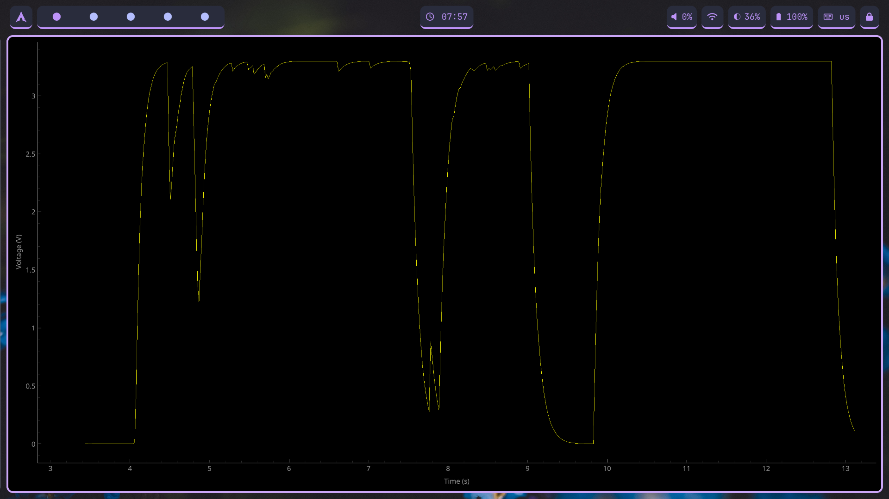

# scopy
Scopy is a lightweight DIY oscilloscope built on the ESP32.


## Overview
- **ESP code (`scopy_main.c`)**: Reads ADC and prints values to serial.
- **Python main (`main.py`)**: Reads serial data in real-time and plots it.
- **Python viewer (`scripts/view.py`)**: Loads previously dumped CSV data and displays it graphically.


## Features
- Real-time ADC reading and plotting.
- CSV logging for offline analysis.
- Dedicated viewer script for inspecting dumped data.

## Prerequisites
- Python 3.10+ recommended
- ESP-IDF for building and flashing the ESP firmware
- Serial connection to the ESP device

## Installation Steps
### Cloning Repo & Setting the environment up
```bash
git clone https://github.com/qulxizer/scopy.git
cd scopy
```
```bash
python -m venv venv
source venv/bin/activate  # Linux/macOS
venv\Scripts\activate     # Windows
```
```bash
pip install -r requirements.txt
```
### Build and flash ESP firmware
```bash
cd esp
idf.py build
idf.py -p /dev/ttyUSBx flash monitor
```

### Run Python logger
```bash
cd ../python
python main.py
```
### View previously dumped NPY
```bash
python scripts/view.py
```
